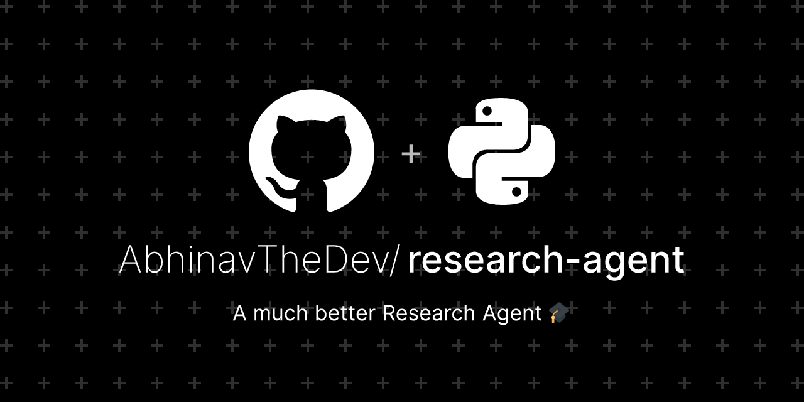

## ⭐ About
- Open Source Web App for your complex research tasks. 
- Built with NextJS and Langchain
- Uses Langgraph's research assistant framework for research workflow.
- Provide Comprehensive Research on any topic in a single click.

| Demo Video                                                                                                                                                        | Blog Post                                                                 |
|-------------------------------------------------------------------------------------------------------------------------------------------------------------------|--------------------------------------------------------------------------|
| [](https://youtu.be/-2Rs2kjHpQY) | [](https://dev.to/abhinav-writes/ai-the-research-companion-mj9) |

### :hammer_and_wrench: Tech Stack

<p align="center">
  
  
  
  
  
  
  
</p>

### :outbox_tray: Set up

#### **Setting Up the Agent**

##### **1. Get an API Key**
- Obtain a **GROQ_API_KEY**. 

##### **2. Clone the Repository**
- Clone the repository to your local machine:
   ```sh
   git clone https://github.com/AbhinavTheDev/research-agent.git
   cd research-agent
   ```

##### **3. Set Up the Backend**
- Navigate to the backend folder:
   ```sh
   cd backend
   ```
- Install dependencies using Pip:
   ```sh
   pip install -r requirements.txt
   ```
- Create a `.env` file inside the `./backend` directory with your **GROQ_API_KEY**:
   ```
   GROQ_API_KEY=YOUR_API_KEY_HERE
   ```
- Run the agent server:
   ```sh
   python server.py
   ```
#### Server is now running on `https://localhost:8000`

##### **4. Set Up the Frontend**
- Navigate to the frontend directory in separate terminal window:
   ```sh
   cd frontend
   ```
- Install dependencies using npm:
   ```sh
   npm i
   ```
- Run the Next.js project:
   ```sh
   npm run dev
   ```

#### **Troubleshooting**
1. Ensure no other local application is running on port **8000**.
2. In the file `/backend/server.py`, change the address from `0.0.0.0` to `127.0.0.1` or `localhost` if needed.
3. Add correct GROQ API Keys in `.env` file before running server.

### :mailbox: Contact
Hi, I'm Abhinav! 👋  
Connect with me on [LinkedIn](https://www.linkedin.com/in/abhinav-mittal-2a1b002a4/), [X](https://x.com/Abhinav11234) and check out my other projects on [GitHub](https://github.com/AbhinavTheDev).
